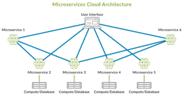
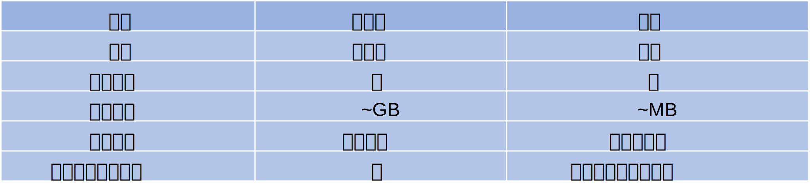
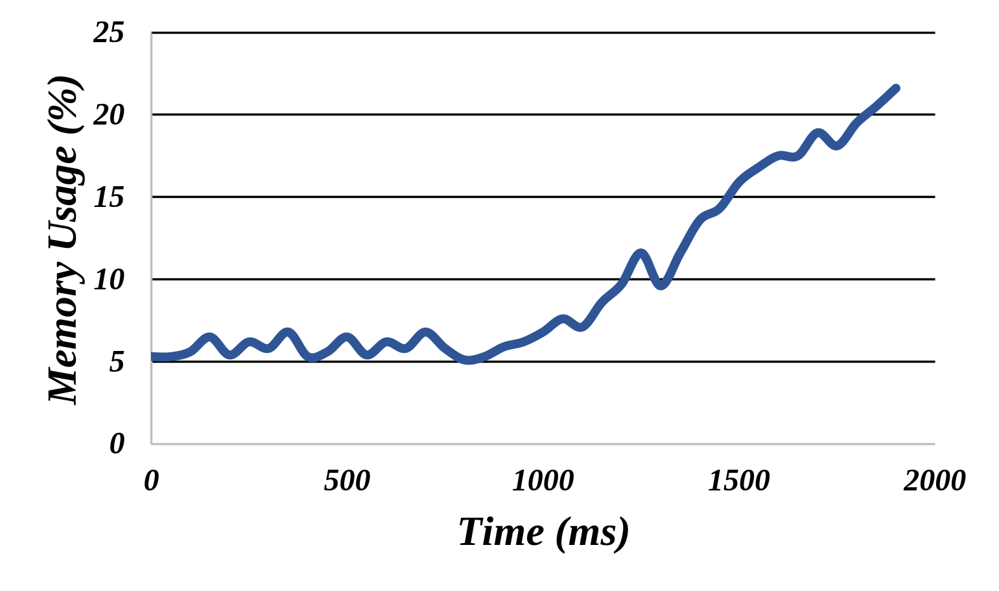

# README

---

> 课程：计算机网络优化方法和理论
>
> 学期：2024\~2025 年秋季学期

---

## 1 作业名称

基于 eBPF 的容器行为模式采集

## 2 作业背景

### 2.1 容器化技术

目前，越来越多的 Web 应用程序采用微服务设计，以提高可扩展性、灵活性和可靠性。每个服务都可以看作是一个独立的应用程序由一组服务组成，这些服务是隔离的、可应用程序，这些服务会暴露自己的端点以与其他服务进行通信。采用微服务架构可以带来很多好处。例如，软件可以更快地发布，团队可以变得更小，专注于自己的工作[^1]。[图 1](#microservice-arch) 展示了微服务架构的示意图。

<div id="microservice-arch">
    <center>
        
        </br>
        图 1：微服务架构示意图
    </center>
</div>


微服务对支持其运行的虚拟化技术提出了新的要求——如何应对巨量的与日俱增的微服务成为一个问题，因此轻量级的虚拟化技术是迫切要求。

容器技术是一种新兴的虚拟化技术。与传统的基于虚拟机监视器（VMM）的虚拟化不同，基于容器的虚拟化技术共享相同的底层主机操作系统。而没有 VMM 和 Guest OS，这种差异有助于容器消除大部分虚拟机（VM）所遭受的开销。在各种工作负载下，容器在 CPU、访存和 I/O 等方面实现了接近原生性能。从 [表 1](#vm-container) 中可以看出，相比于虚拟机技术，容器技术具有可迁移、速度快、低开销、易于管理的特点，由此可以满足微服务的要求。

<div id="vm-container">
    <center>
        
        </br>
        表 1：虚拟机与容器对比表
    </center>
</div>


当今容器化技术已经成为了云服务的标准技术，多种云服务框架，如 Istio[^2]、Linkerd[^3]、Knative[^4]、OpenFaaS[^5] 等都是针对容器底座（尤其是 Kubernetes[^6] 底座）设计的。

### 2.2 容器异常

容器在运行过程中通常发生异常行为，例如不正确的应用程序、基础设施的漏洞、攻击者的恶意的攻击等等。当容器发生异常时，通常体现出容器的资源使用发生变化。因此，我们**将异常定义为特定指标在较长时间内持续增加或减少的现象**。例如宿主机的 CPU 利用率、内存利用率、网络资源利用率等指标升高。如 [图 2](#memory-leak) 体现出容器异常通常体现为内存泄漏导致内存指标的持续升高的异常容器情形。

<div id="memory-leak">
    <center>
        
        </br>
        图 2：内存泄漏导致的容器异常
    </center>
</div>

诱发容器异常的因素可能是多方面的。例如：

+ 应用程序问题：正在运行的程序中的死循环会消耗掉大量的 CPU 资源，内存泄漏会导致内存使用率变高[^7]，网络协议的设计不当导致大量冗余连接等等；
+ 恶意攻击问题：基础设施可能存在漏洞（如操作系统的漏洞、容器引擎的漏洞、对隔离性的误配置等等），恶意的攻击者利用这些漏洞突破隔离限制获取宿主机的 CPU、内存和网络资源等。

### 2.3 eBPF

eBPF（extened Berkeley Packet Filter）[^8]是一种内核技术，它允许开发人员在不修改内核代码的情况下运行特定的功能。eBPF 的概念源自于 Berkeley Packet Filter（BPF）[^9]，后者最初是由贝尔实验室开发的一种捕获和过滤网络数据包的过滤器。eBPF 经过不断的发展和功能完善已经被广泛应用于网络监控[^10]、安全过滤[^11]、性能分析[^12]等多种场景中。eBPF 的强大能力也为容器异常检测提供了更多的机会。例如，eBPF 可以抓取进程的系统调用、内核函数以及用户态函数的调用，等等，以此来得到容器的行为信息。

## 3 作业内容

### 3.1 内容概述

容器的异常通常表现为容器的异常行为。因此，对容器的行为信息的采集对容器的异常分析非常有帮助。

基于此，本次作业将使用 eBPF 技术采集容器之行为信息。

容器的行为信息可能包括：

+ 内存申请和释放
+ 开辟新的进程或线程
+ 新增网络连接
+ 发送及接收数据包的情况
+ ……

因此，本次作业拟基于 eBPF 对容器的如下资源使用指标进行观测：

+ 内存用量
+ 网络连接数量
+ 接收与发送数据包字节数

最终绘制出统计图。

统计图以前端形式呈现，需要有可操作的 UI。建议使用一些现有的数据可视化工具，例如 [Grafana](https://grafana.com/) 等。

### 3.2 No-credit Challenge

+ 考虑到容器可能是多进程的，如何得到容器的资源使用总量图？
+ 探究你的方法中数据采集的开销是否是微服务运行可以承受的，数据采集本身的开销是否会影响容器正常运行？
+ 当容器量非常庞大的时候，如何设计方案降低存储开销？

## 4 代码框架

作业给出简要的代码框架，内容包含：

+ `anomaly-progs`：示例程序，运行 `make -j$(nproc)` 构建
  + `merge-sort.cpp`：归并排序示例程序，编译后生成 `build/merge-sort`
  + `merge-sort-leak.cpp`：归并排序内存泄漏示例程序，编译后生成 `build/merge-sort-leak`
  + `data`
    + `merge-data.py`：生成随机数，供归并排序使用
+ `src`：容器数据采集代码
  + `ebpf`：eBPF 程序框架[^13]，包含一个监控 `getpid` 系统调用的示例程序。在 Linux 机器上先运行 `gen.sh` 生成适合本机的 `vmlinux.h`，然后运行 `make -j$(nproc)` 编译，最终生成 eBPF 程序 `test.bpf.o` 以及 `test` 用户态程序，在 `src/ebpf` 目录下以 `root` 用户执行 `./test` 可运行该程序
  + `monitor`：监控程序目录

代码的目录结构可根据实际需要做适当调整。

## 5 实验环境准备

实验需要一台 Linux 虚拟机或物理机（以 Ubuntu 24.04 为例）：

> 注：不要试图使用 [WSL](https://learn.microsoft.com/en-us/windows/wsl/)，其由于 PID namespace 隔离机制，使得[在 WSL distro 内看到的进程号与 eBPF 抓取到的进程号不一致](https://github.com/microsoft/WSL/issues/12115)。

+ 安装 Linux 内核 SDK：

  ```bash
  $ apt install -y linux-image-unsigned-$(uname -r)
  ```

+ 安装 eBPF 相关工具：

  ```bash
  $ apt install -y libbpf-dev libbpf-tools libbpfcc-dev
  ```

## Hints

+ 可能用到的一些 eBPF Hook：`tracepoint/raw_syscalls/sys_enter` 可以抓取所有的系统调用；`kprobe/handle_mm_fault` 可以抓取页面缺失，与内存分配相关；`kprobe/__<arch>_sys_xxx` 可以在特定指令集架构的平台下抓取特定系统调用，如 `kprobe/__x64_sys_clone` 抓取 `SYS_clone` 系统调用；
+ `bpf_trace_printk` 会打印调试信息到 `/sys/kernel/debug/tracing/trace_pipe` 中，但仅当 `/sys/kernel/debug/tracing/events/syscalls/sys_enter_execve/enable` 中内容为 `1` 时才会打印，可以使用 `echo 1 > /sys/kernel/debug/tracing/events/syscalls/sys_enter_execve/enable` 修改其内容。

## 6 提交内容

+ 全部源代码的压缩包（使用 `.tar.gz` 格式，命名为 `学号_姓名_ebpf.tar.gz`）
+ 实验报告（`.md`、`.doc`、`.docx` 或 `.pdf`），放在源代码中的 `docs` 目录内，命名为 `report.xxx`（`xxx` 为文件扩展名），需包含：
  + 代码运行方式
  + 系统架构图及系统架构与各模块概述
  + 主要设计点及创新点
  + 所用测试用例以及测试方法
  + 测试结果及说明
  + 效果展示截图
  + 系统运行开销统计结果及说明
  + 系统优缺点分析
  + 实验心得和体会

> `.tar.gz` 文件压缩方法：设存在一个目录名为 `example`，执行：
>
> ```bash
> $ tar -zcvf example.tar.gz example
> ```
>
> 解压方法：
>
> ```bash
> $ tar -xvf example.tar.gz
> ```

## 延伸阅读

+ [Docker 与容器简介](https://docs.eesast.com/docs/web/cloud_native/docker)
+ [Kubernetes 简介](https://kubernetes.io/docs/tutorials/kubernetes-basics/)
+ [eBPF 入门教程](https://www.bilibili.com/video/BV1K34y1P7mg)

## 参考文献

[^1]: Du, Q., Xie, T., & He, Y. (2018). Anomaly detection and diagnosis for container-based microservices with performance monitoring. In Algorithms and Architectures for Parallel Processing: 18th International Conference, ICA3PP 2018, Guangzhou, China, November 15-17, 2018, Proceedings, Part IV 18 (pp. 560-572). Springer International Publishing.
[^2]: <https://istio.io/>
[^3]: <https://linkerd.io/>
[^4]: <https://knative.dev/>
[^5]: <https://www.openfaas.com/>
[^6]: <https://kubernetes.io/>
[^7]: Zou, Z., Xie, Y., Huang, K., Xu, G., Feng, D., & Long, D. (2019). A docker container anomaly monitoring system based on optimized isolation forest. IEEE Transactions on Cloud Computing, 10(1), 134-145.
[^8]: <https://ebpf.io/>
[^9]: <https://en.wikipedia.org/wiki/Berkeley_Packet_Filter>
[^10]:  Cilium, <https://cilium.io/>. (Accessed March 7, 2024).
[^11]: Falco, <https://falco.org/>. (Accessed March 7, 2024).
[^12]: BCC, <https://github.com/iovisor/bcc>. (Accessed March 7, 2024).
[^13]: <https://github.com/Timothy-Liuxf/ebpf-examples>